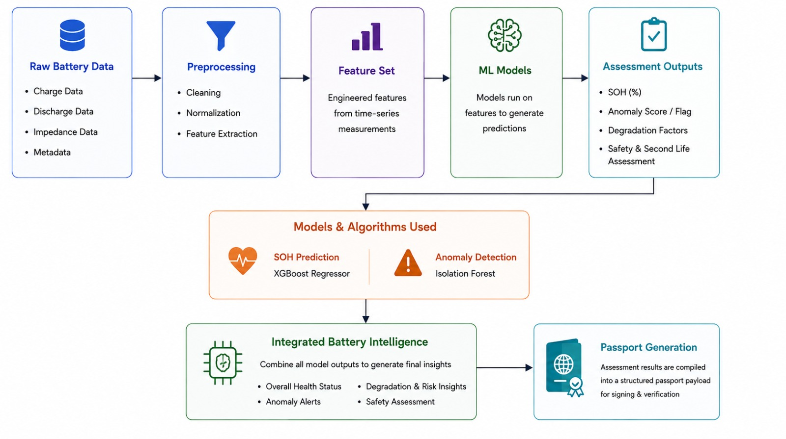
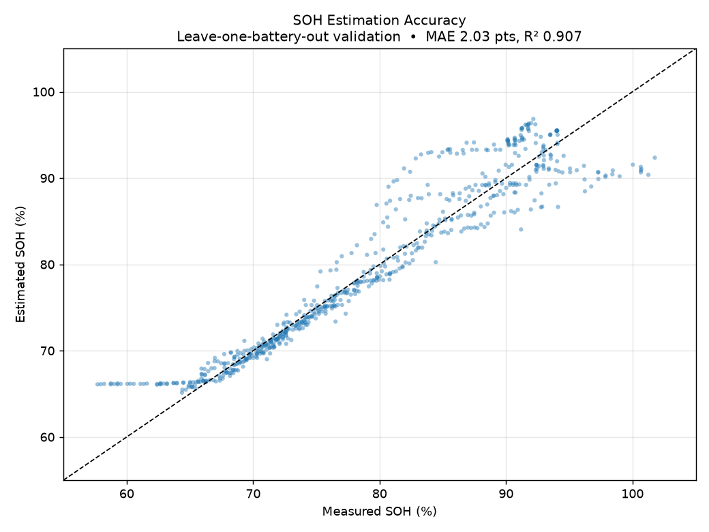
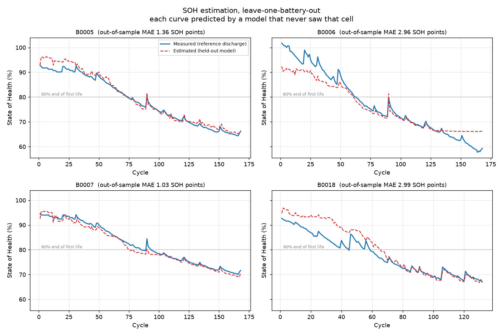
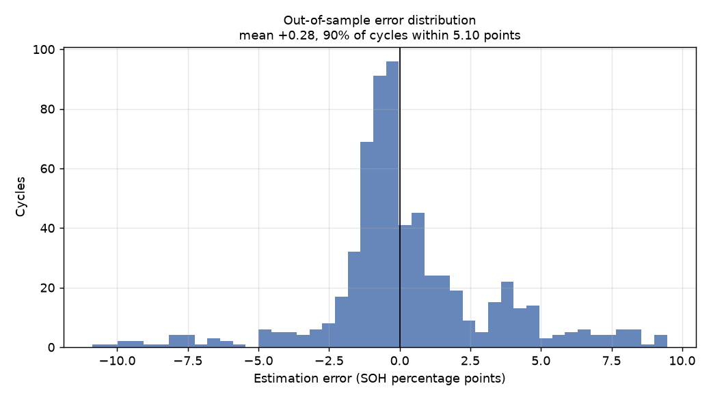
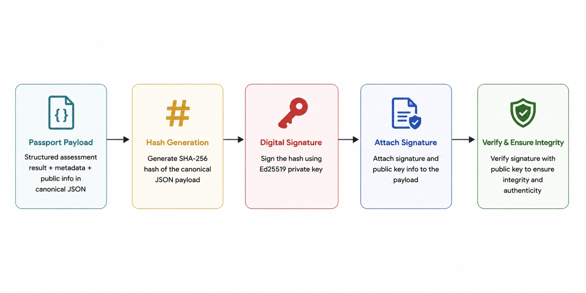

# BATRIS — Battery Traceability & Reliability Intelligence System

BATRIS is a battery assessment platform that estimates battery health, detects abnormal behaviour, evaluates safety and second-life suitability, and generates a verifiable digital battery passport.

The underlying models are trained and validated using the NASA Li-ion Battery Aging Dataset, collected at the NASA Ames Research Center, which contains repeated charge, discharge and impedance measurements from lithium-ion battery cells to capture real battery ageing and degradation patterns.

**View Live:** https://batris.vercel.app

**Demo Video:** [Watch the BATRIS demo on YouTube](https://youtu.be/BtZZVv-KXfQ)

## Features

- State of Health (SOH) estimation using XGBoost
- Calibrated SOH uncertainty estimation
- Battery anomaly detection using Isolation Forest and engineering rules
- Safety risk assessment
- Second-life suitability grading
- Explainable battery-health predictions
- Assessment of batteries with different levels of available data
- Digital battery passport generation
- SHA-256 hashing and Ed25519 digital signatures for passport integrity
- User authentication and secure access to battery assessments and passports
- QR-based passport access
- PDF battery passport generation

## How It Works

- Optionally create an account and log in to save and manage your battery assessments and digital passports.
- Select a battery from the available dataset and run an assessment for a specific cycle.
- Assess your own battery by entering the available battery and charging information.
- Upload your own battery telemetry as a CSV and run the same assessment pipeline.
- The system processes the available data and estimates SOH, detects anomalies, evaluates safety and determines second-life suitability.
- View the assessment results along with confidence information and the main factors affecting battery health.
- Generate a digital battery passport containing the assessment results and model information.
- Download the passport as JSON or PDF.
- A QR code is generated for the passport and can be linked to the physical battery.
- Scan the QR code to access the associated digital passport.
- Verify the passport signature to check whether the signed information has been changed.

## System Architecture



## Model Validation

BATRIS uses Leave-One-Battery-Out Cross-Validation to evaluate SOH prediction on batteries that were not used during training.

### Full SOH Model

| Metric |           Result |
| ------ | ---------------: |
| MAE    | ~2.06 SOH points |
| R²     |            ~0.90 |

The system also evaluates reduced-information input tiers to measure how prediction performance changes when less battery data is available.

### SOH Prediction Accuracy



### SOH Trajectories



### Prediction Error Distribution



## Digital Battery Passport

BATRIS packages the assessment results, model information and relevant metadata into a structured digital passport.

The passport is hashed using SHA-256 and signed using an Ed25519 private key. The resulting passport can be verified to detect changes to the signed information.



The physical battery can also be linked to its digital passport through a QR code, allowing the passport to be retrieved and verified easily.

## Running Locally

Create a virtual environment:

```bash
python -m venv .venv
```

Activate it.

**Windows PowerShell**

```powershell
.venv\Scripts\Activate.ps1
```

**Linux/macOS**

```bash
source .venv/bin/activate
```

Install dependencies:

```bash
pip install -r requirements.txt
```

Start the backend:

```bash
python -m backend.batris.api
```

For the frontend:

```bash
cd frontend
npm install
npm run dev
```

## Training

Regenerate the processed dataset:

```bash
python -m backend.batris.build_dataset
```

Train the SOH models:

```bash
python -m backend.batris.train_soh
```

Train the anomaly models:

```bash
python -m backend.batris.train_anomaly
```

Train the assessment-tier models:

```bash
python -m backend.batris.train_tiers
```

## Team

Developed by **Team Ascend**

| Member                    | GitHub                                                     |
| ------------------------- | ---------------------------------------------------------- |
| **Aarush Kumar**          | [@aarushkx](https://github.com/aarushkx)                   |
| **Abhinav Mehta**         | [@Abhinav-Mehta-456](https://github.com/Abhinav-Mehta-456) |
| **Abinash Behera**        | [@abinash162006](https://github.com/abinash162006)         |
| **Aditya Ojha**           | [@aditya-ojha01](https://github.com/aditya-ojha01)         |
| **Jagdish Pattnaik**      | [@jagdish-ai-hub](https://github.com/jagdish-ai-hub)       |
| **Prapti Prayashi Sahoo** | [@prapti11](https://github.com/prapti11)                   |

## License

MIT License
