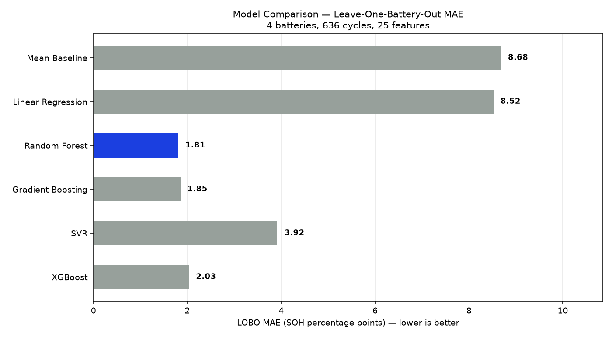
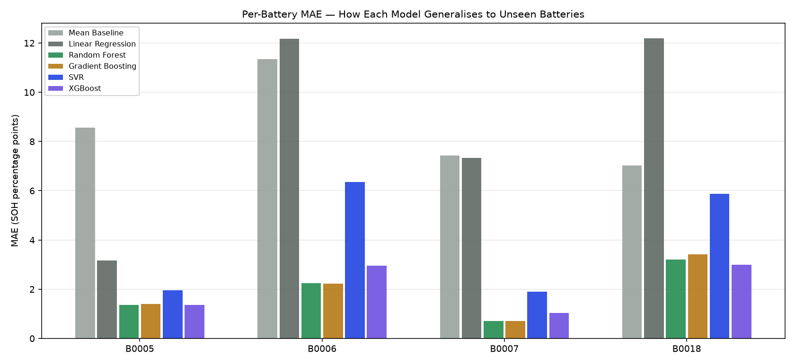

# BATRIS — Battery Traceability & Reliability Intelligence System

BATRIS is a battery assessment platform that estimates battery health, detects abnormal behaviour, evaluates safety and second-life suitability, and generates a verifiable digital battery passport.

The underlying models are trained and validated using the NASA Li-ion Battery Aging Dataset, collected at the NASA Ames Research Center, which contains repeated charge, discharge and impedance measurements from lithium-ion battery cells to capture real battery ageing and degradation patterns.

**View Live:** https://batris.vercel.app

**Demo Video:** [Watch the BATRIS Version 1 demo on YouTube](https://youtu.be/BtZZVv-KXfQ)

> _Note: This demo showcases the initial Version 1 release. Some features have been added and updated in Version 2._

## Features

- State of Health (SOH) estimation using XGBoost
- Calibrated SOH uncertainty estimation
- Battery anomaly detection using Isolation Forest and engineering rules
- Safety risk assessment
- Second-life suitability grading
- Explainable battery-health predictions
- Assessment of batteries with different levels of available data
- Model benchmarking across multiple regression algorithms
- Leave-One-Battery-Out validation for unseen-battery generalisation
- Battery health timeline showing condition changes, degradation events and anomalies over time
- Health timeline PDF generation
- Second-life battery marketplace with assessment-derived listings
- Filtering of marketplace inventory by reuse grade, chemistry and retained SOH
- Seller-managed listings with public contact details and withdrawal support
- Digital battery passport generation
- SHA-256 hashing and Ed25519 digital signatures for passport integrity
- User authentication and secure access to battery assessments and passports
- QR-based passport access
- PDF battery passport generation

## How It Works

- Optionally create an account and log in to save and manage your battery assessments, digital passports and marketplace listings.
- Select a battery from the available dataset and run an assessment for a specific cycle.
- Assess your own battery by entering the available battery and charging information.
- Upload your own battery telemetry as a CSV and run the same assessment pipeline.
- The system processes the available data and estimates SOH, detects anomalies, evaluates safety and determines second-life suitability.
- View the assessment results along with confidence information and the main factors affecting battery health.
- Review the battery health timeline to see health phases, state transitions, degradation milestones, anomaly events and recent fade-rate behaviour.
- Download the health timeline as a PDF for a portable record of the battery's condition over time.
- Compare candidate SOH models using the benchmark page, which evaluates all models under the same leave-one-battery-out validation protocol.
- Generate a digital battery passport containing the assessment results and model information.
- Download the passport as JSON or PDF.
- Publish an assessed battery to the second-life market. Published health, safety and reuse information is derived directly from the platform's assessment rather than entered manually.
- Browse and filter second-life listings by reuse grade, chemistry and retained SOH, then contact sellers directly to discuss the battery.
- A QR code is generated for the passport and can be linked to the physical battery.
- Scan the QR code to access the associated digital passport.
- Verify the passport signature to check whether the signed information has been changed.

## System Architecture


## Model Validation

BATRIS uses Leave-One-Battery-Out Cross-Validation to evaluate SOH prediction on batteries that were not used during training. The current full assessment pipeline uses XGBoost for the production SOH estimate, while the benchmark evaluates multiple candidate regressors under the same validation protocol.

### Full SOH Model

| Metric        |            Result |
| ------------- | ----------------: |
| MAE           |  ~2.03 SOH points |
| RMSE          |  ~3.03 SOH points |
| R²            |             ~0.91 |
| Maximum error | ~10.88 SOH points |

The system also evaluates reduced-information input tiers to measure how prediction performance changes when less battery data is available.

### Model Benchmark

The benchmark compares six candidate regression models using the same 25 SOH features and the same leave-one-battery-out folds across four NASA batteries (636 cycles in total). The model with the lowest unseen-battery MAE is selected as the benchmark winner.

| Model             | LOBO MAE ↓ |   RMSE ↓ |      R² ↑ | Max Error ↓ |  Bias |
| ----------------- | ---------: | -------: | --------: | ----------: | ----: |
| **Random Forest** |   **1.81** |     2.86 |     0.917 |       13.40 | +0.48 |
| Gradient Boosting |       1.85 | **2.84** | **0.918** |       11.16 | +0.56 |
| XGBoost           |       2.03 |     3.03 |     0.907 |   **10.88** | +0.28 |
| SVR               |       3.92 |     5.57 |     0.685 |       19.70 | +2.24 |
| Linear Regression |       8.52 |     9.93 |     0.000 |       27.62 | -6.81 |
| Mean Baseline     |       8.68 |    10.09 |    -0.032 |       22.06 | -0.02 |

The benchmark therefore identifies **Random Forest** as the strongest model by unseen-battery MAE. This comparison is used to evaluate model generalisation; the production assessment pipeline currently continues to use its trained XGBoost model and calibrated uncertainty model.





### SOH Prediction Accuracy


### SOH Trajectories


### Prediction Error Distribution


## Digital Battery Passport

BATRIS packages the assessment results, model information and relevant metadata into a structured digital passport.

The passport is hashed using SHA-256 and signed using an Ed25519 private key. The resulting passport can be verified to detect changes to the signed information.


The physical battery can also be linked to its digital passport through a QR code, allowing the passport to be retrieved and verified easily.

## Version 2 — New Features

### Model Benchmark

Compares different machine learning models to identify the best-performing approach for battery health estimation, helping improve the accuracy and reliability of the results.

### Battery Health Timeline

Provides a chronological view of battery health, including health-state changes, degradation milestones, threshold crossings, and anomalies. The timeline is generated from the existing BATRIS assessment and can be filtered and exported as a PDF.

### Second-Life Market

A marketplace for batteries assessed for second-life use. Listings include assessment-based SOH, safety status, anomalies, and reuse grade, with filters for grade, chemistry, and minimum SOH. Buyers can browse and filter available batteries, while sellers can list assessed batteries for potential second-life use.

## Running Locally

Create a virtual environment:

```bash
python -m venv .venv
```

Activate it.

**Windows PowerShell**

```powershell
.venv\Scripts\Activate.ps1
```

**Linux/macOS**

```bash
source .venv/bin/activate
```

Install dependencies:

```bash
pip install -r requirements.txt
```

The authentication and marketplace features use MongoDB. Start a local MongoDB instance or use MongoDB Atlas, then configure the connection in `backend/.env`.

```env
MONGODB_URI=mongodb://127.0.0.1:27017
MONGODB_DB_NAME=batris
BATRIS_AUTH_SECRET=replace-with-a-long-random-secret
BATRIS_COOKIE_SECURE=0
```

Start the backend:

```bash
python -m backend.batris.api
```

For the frontend:

```bash
cd frontend
npm install
npm run dev
```

## Training

Regenerate the processed dataset:

```bash
python -m backend.batris.build_dataset
```

Train the SOH models:

```bash
python -m backend.batris.train_soh
```

Train the anomaly models:

```bash
python -m backend.batris.train_anomaly
```

Train the assessment-tier models:

```bash
python -m backend.batris.train_tiers
```

Run the model benchmark:

```bash
python -m backend.batris.benchmark
```

The benchmark writes its summary to `generated/reports/benchmark_results.json` and generates the comparison plots in `generated/plots/`.

## Team

Developed by **Team Ascend**

| Member                    | GitHub                                                             |
| ------------------------- | ------------------------------------------------------------------ |
| **Aarush Kumar**          | [@aarushkx](https://github.com/aarushkx)                           |
| **Abhinav Mehta**         | [@Abhinav-Mehta-456](https://github.com/Abhinav-Mehta-456)         |
| **Abinash Behera**        | [@abinash162006](https://github.com/abinash162006)                 |
| **Aditya Ojha**           | [@aditya-ojha01](https://github.com/aditya-ojha01)                 |
| **Prapti Prayashi Sahoo** | [@praptiprayashi11-lang](https://github.com/praptiprayashi11-lang) |

## License

MIT License
