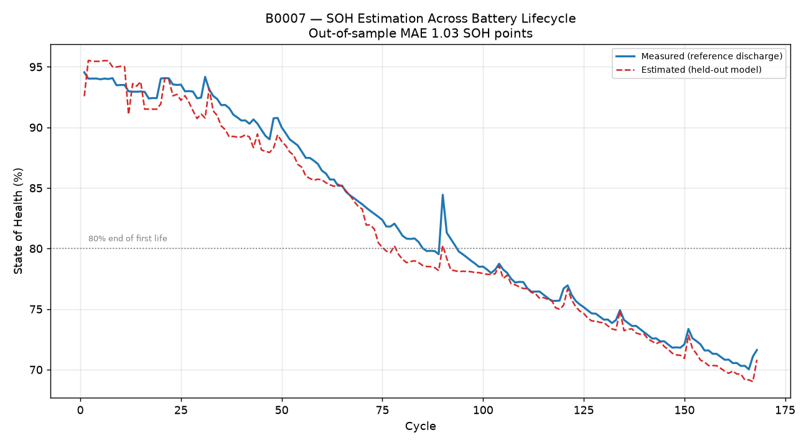

# Model Evaluation Report

Generated by `python -m backend.batris.evaluate`.

- Cycles: **636**
- Batteries: **4** (B0005, B0006, B0007, B0018)
- SOH range in data: **57.7% - 101.8%**

## 1. State of Health estimation

SOH is evaluated using **leave-one-battery-out validation**: the model is trained on all batteries except one and then tested on the completely unseen battery. This gives an out-of-sample estimate of how the model performs when a new battery is presented to BATRIS.

| Variant | Features | LOBO MAE (SOH pts) | LOBO R2 |
|---|---|---|---|
| `full` | 25 | **2.03** | 0.907 |
| `provenance_free` | 15 | **2.67** | 0.865 |

### Representative battery trajectory

The generated lifecycle plot focuses on **B0007**, where the held-out model tracks the measured SOH trajectory across cycles. The plotted estimate is produced without training on B0007.

### SOH prediction accuracy

The parity plot compares measured SOH with BATRIS's out-of-sample estimated SOH. Points closer to the diagonal indicate closer agreement between the estimate and the reference measurement.

### Per-battery breakdown

**`full`**

| Held-out battery | Cycles | MAE (SOH pts) | RMSE | R2 |
|---|---|---|---|---|
| B0005 | 168 | 1.36 | 0.0186 | +0.962 |
| B0006 | 168 | 2.96 | 0.0406 | +0.896 |
| B0007 | 168 | 1.03 | 0.0124 | +0.976 |
| B0018 | 132 | 2.99 | 0.0410 | +0.718 |

**`provenance_free`**

| Held-out battery | Cycles | MAE (SOH pts) | RMSE | R2 |
|---|---|---|---|---|
| B0005 | 168 | 2.03 | 0.0268 | +0.920 |
| B0006 | 168 | 5.00 | 0.0578 | +0.789 |
| B0007 | 168 | 1.07 | 0.0130 | +0.974 |
| B0018 | 132 | 2.55 | 0.0319 | +0.829 |

### Uncertainty calibration

- `full`: the raw 90% quantile interval covered **68%** of held-out points. Widening by **3.22x** restores 90% coverage.
- `provenance_free`: the raw 90% quantile interval covered **61%** of held-out points. Widening by **9.08x** restores 90% coverage.

Quantile regression is fitted in-distribution, so on an unseen cell the raw interval is systematically too narrow. Reporting a 90% interval that does not achieve its intended coverage can create misplaced confidence in a safety-relevant number. The calibration factor is derived from held-out residuals only.

## 2. Feature ablation

Each group is removed, then used alone, with LOBO re-run each time. Feature importance alone is misleading when features are correlated; removal shows what is genuinely irreplaceable.

| Configuration | Features | MAE (SOH pts) | Change vs all features |
|---|---|---|---|
| all features | 25 | 2.035 |  |
| without charge acceptance | 16 | 3.223 | +1.188 |
| without internal resistance | 20 | 2.204 | +0.169 |
| without thermal stress | 19 | 2.043 | +0.008 |
| without usage history | 20 | 3.514 | +1.479 |
| only charge acceptance | 9 | 2.547 | +0.512 |
| only internal resistance | 5 | 7.807 | +5.772 |
| only thermal stress | 6 | 8.103 | +6.069 |
| only usage history | 5 | 2.879 | +0.844 |

## 3. Assessing a battery with no recorded history

A separate model is trained and validated for each level of information a user might have about a battery that is not in the dataset. Validation is the same leave-one-battery-out protocol used throughout.

| Tier | Input | Signals | LOBO MAE (SOH pts) | R2 | Worst cell | Output |
|---|---|---|---|---|---|---|
| 1 | Charge telemetry with impedance diagnostics | 15 | **2.67** | 0.866 | 5.00 | Full report |
| 2 | Charge telemetry | 13 | **2.75** | 0.855 | 5.03 | Full report |
| 3 | Charge summary (hand-entered) | 6 | **2.94** | 0.830 | 5.87 | Full report |
| 4 | Minimal (charge phase split only) | 2 | **5.82** | 0.044 | 13.81 | Indicative only |

Two results are worth drawing out.

The first is that **tier 3 costs almost nothing**. Six numbers a person can read off a charger display give up roughly 0.2 SOH points against a fully instrumented charge curve. Most of the signal lives in how a charge divides between its constant-current and constant-voltage phases, and that ratio survives being reduced to a few hand-typed figures. Useful battery assessment does not require laboratory equipment.

The second is that **tier 4 fails, and is reported as failing**. With only the CC/CV split, R2 collapses and the worst cell misses by 13 SOH points. The platform still returns a number at this tier but refuses to issue a reuse grade from it. Knowing where a method stops working is part of reporting it honestly.

A model per tier is used rather than one model with nulls passed for missing inputs. XGBoost tolerates NaN, so the single-model approach runs without complaint and returns a confident number drawn from a feature distribution it was never fitted on, with nothing to signal that anything is wrong. Per-tier training means the accuracy quoted to a user is the accuracy measured for their situation.

## 4. Anomaly detection

- False-alarm rate on unmodified data: **9.4%** (636 cycles)
- Mean recall across injected fault types: **96.7%**

| Injected fault | Recall | Rated critical | Mean score |
|---|---|---|---|
| thermal runaway precursor | 100.0% | 100.0% | 98.2 |
| resistance fault | 96.7% | 96.7% | 95.8 |
| charge interruption | 100.0% | 6.7% | 61.0 |
| deep discharge | 100.0% | 100.0% | 91.8 |
| over rate charging | 86.7% | 3.3% | 51.8 |

The dataset contains no labelled faults, so recall is measured by stamping known physical fault signatures onto real healthy cycles *inside an intact battery history*. Both numbers are reported together because a detector that flags everything achieves perfect recall and is useless.

## 5. Figures

## 6. Known limitations

- **Four cells.** All from one chemistry (LCO 18650) at one ambient temperature (24 C). Cell-to-cell variability cannot be characterised from three training units, which is why honest confidence intervals come out wide.
- **No ambient temperature variation.** The thermal pathway is implemented and exercised by measured cell temperature, but ambient is constant in this dataset, so its effect is untested.
- **No real faults.** Anomaly recall is measured against synthetic injections, which is weaker evidence than field failure data.
- **Single chemistry.** The multi-format round trip proves the code is scale- and unit-correct, not that a model trained on LCO transfers to LFP or NMC. That needs real multi-chemistry data. Requests for a non-LCO format are flagged as extrapolation and their intervals widened 1.6x, but that factor is an engineering judgement rather than a measured quantity.
- **Tier 3 assumes a CC-CV charger.** The questionnaire asks for a steady phase and a tapering phase. Multi-step or pulse charging does not divide cleanly that way and those figures would be guesses.
- **Estimates, not certifications.** Nothing here substitutes for an accredited capacity test.
